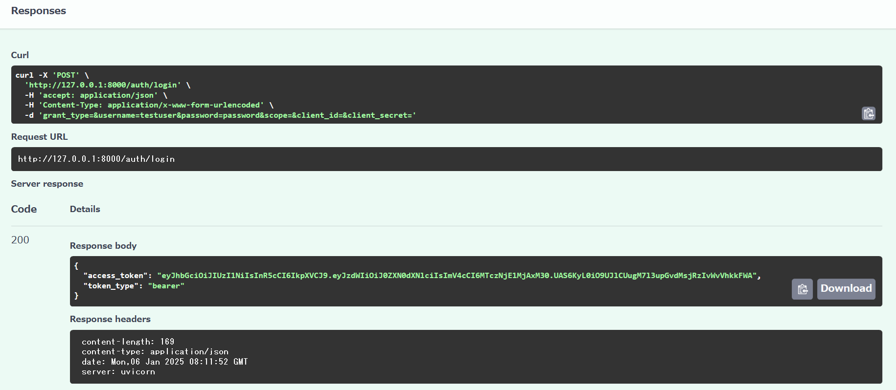
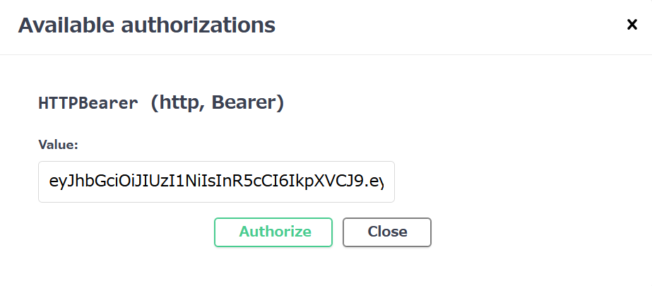

# Translation API

**A FastAPI-based translation service** powered by Google Cloud Translation API. This project demonstrates expertise in **API development**, **cloud integration**, **containerization**, and **backend engineering**—designed for professional portfolios and global job applications.

---

## Overview

The **Translation API** enables seamless text translation with:
- **Language Detection**: Automatically identifies the source language.
- **Text Translation**: Converts text into the specified target language.
- **Batch Translation**: Translates multiple texts in a single request.
- **Error Handling**: Provides clear responses for invalid or unsupported requests.

This project showcases proficiency in:
- Developing RESTful APIs using FastAPI.
- Integrating Google Cloud services.
- Deploying high-performance, containerized applications.
- Secure authentication with JWT.

---

## Project Structure

```
translation_app/
├── main.py                      # Main application file
├── auth.py                      # Authentication and JWT logic
├── settings.py                  # Configuration for environment variables and application settings
├── dependencies.py              # Dependency injection for application components
├── models/                      # Pydantic models for API and user handling
│   ├── __init__.py              # Init file for models module
│   ├── token.py                 # Token models
│   ├── history_model.py         # Translation history model
│   ├── translation_model.py     # Models for translation requests
├── routes/                      # Application routes
│   ├── __init__.py              # Init file for routes module
│   ├── translation.py           # Translation API logic
│   ├── history.py               # History management routes
├── services/                    # Business logic for the application
│   ├── history_service.py       # History management logic
├── utils/                       # Utility functions
│   ├── __init__.py              # Init file for utils module
│   ├── translate.py             # Google Translate interaction
├── Dockerfile                   # Docker configuration
├── requirements.txt             # Python dependencies
├── .gitignore                   # Files to ignore in Git
├── README.md                    # Project documentation
├── .env                         # Environment variables
├── service-account-key.json     # GCP credentials (ignored in Git)
└── request_translation.py       # Testing script
```

---

## Features

- **Effortless Translation**: Supports multiple languages for accurate translation.
- **Source Language Detection**: Automatically detects the input language.
- **Batch Translation**: Efficiently processes multiple texts in one request.
- **Developer-Friendly Interface**: Swagger UI for interactive API testing.
- **Secure Authentication**: Token-based JWT protection for all endpoints.
- **Translation History Management**: Save, retrieve, and clear translation logs with ease.
- **Containerized Deployment**: Ready for Docker and Google Cloud Run.

---

## Tech Stack

- **FastAPI**: A fast and modern Python web framework.
- **Google Cloud Translation API**: Industry-leading translation capabilities.
- **FastAPI-JWT-Auth**: Secure and flexible JWT authentication.
- **Python-dotenv**: Secure management of environment variables.
- **Uvicorn**: ASGI server for high-speed API hosting.

---

## API Endpoints

### Authentication Endpoint

- **Token Expiry**: The issued token expires after **15 minutes**. A new token must be obtained by logging in again.

- **Error Examples**:
  - Invalid Token:
    ```json
    {
      "detail": "Invalid token: Signature verification failed."
    }
    ```
  - Expired Token:
    ```json
    {
      "detail": "Invalid token: Signature has expired."
    }
    ```

#### Login Endpoint
- **URL**: `/auth/login`
- **Method**: `POST`
- **Request Body**:
  ```json
  {
    "username": "testuser",
    "password": "password"
  }
  ```
  - **Response Example**:
  ```json
  {
    "access_token": "your-jwt-token",
    "token_type": "bearer"
  }
  ```

#### Protected Endpoint
- **URL**: `/auth/protected`
- **Method**: `GET`
- **Headers**:
  - `Authorization`: Bearer {your-jwt-token} (Required)
- **Response Example**:
  ```json
  {
    "message": "Welcome, testuser!"
  }
  ```
- **Error Example**:
  ```json
  {
    "detail": "Invalid token: Signature has expired."
  }
  ```

### Translation Endpoints

#### Translate Text
- **URL**: `/translation/translate`
- **Method**: `POST`
- **Headers**:
  - `Authorization`: Bearer {your-jwt-token} (Required)
- **Request Body**:
  ```json
  {
    "text": "Hello, world!",
    "target_language": "es"
  }
  ```
- **Response Example**:
  ```json
  {
    "translated_text": "¡Hola Mundo!",
    "source_language": "en"
  }
  ```

### Translation History Endpoints

#### Save Translation History
- **URL**: `/save-history/`
- **Method**: `POST`
- **Headers**:
  - `Authorization`: Bearer {your-jwt-token} (Required)
- **Parameters**:
  - `source_text` (string, required): The original text before translation.
  - `translated_text` (string, required): The translated text.

- **Response Example**:
  ```json
  {
    "message": "History saved successfully"
  }
  ```

#### Retrieve Translation History

- **Response Example**:
  ```json
  [
    {
      "source_text": "Hello, I hope this message finds you well. I am sharing the meeting materials.",
      "translated_text": "お世話になっております。会議の資料を共有いたします。",
      "timestamp": "2025-01-02T06:11:39.753698+00:00"
    }
  ]
  ```

#### Clear Translation History
- **URL**: `/history/clear-history`
- **Method**: `DELETE`
- **Headers**:
  - `Authorization`: Bearer {your-jwt-token} (Required)
- **Description**: Deletes all saved translation history entries.
- **Response Example**:
  ```json
  {
    "message": "All translation history has been cleared."
  }
  ```

#### Batch Translate
- **URL**: `/translation/batch-translate`
- **Method**: `POST`
- **Headers**:
  - `Authorization`: Bearer {your-jwt-token} (Required)
- **Request Body**:
  ```json
  {
    "texts": ["hello", "goodbye"],
    "target_language": "es"
  }
  ```
- **Response Example**:
  ```json
  {
    "translations": [
      {"source_text": "hello", "translated_text": "hola"},
      {"source_text": "goodbye", "translated_text": "adios"}
    ],
    "requested_by": "testuser"
  }
  ```
---

## Translation Examples with Screenshots

### Example 1: Translating from English to Norwegian

**Request Body**:
```json
{
  "text": "Thank you for your email. I will get back to you shortly.",
  "target_language": "no"
}
```
**Response Body**:
```json
{
  "translated_text": "Takk for e-posten din. Jeg vil kontakte deg snart."
}
```
**Screenshot**:


### Example 2: Translating from Japanese to French

**Request Body**:
```json
{
  "text": "このプロジェクトについてのご提案ありがとうございます。",
  "target_language": "fr"
}
```
**Response Body**:
```json
{
  "translated_text": "Merci pour votre proposition concernant ce projet."
}
```
**Screenshot**:


---

### Swagger UI Examples

#### Login Endpoint (`POST /auth/login`)
This screenshot demonstrates the response from the login endpoint when valid credentials are provided.



#### Protected Endpoint (`GET /auth/protected`)
This screenshot shows how to authorize and access the protected endpoint using a valid JWT token.



---

### Error Handling

The Translation API provides clear error responses for various scenarios. Below are common examples:

#### Authentication Errors
- **Invalid Token**:
  ```json
  {
    "detail": "Invalid token: Signature verification failed."
  }
  ```
  - **Cause**: The provided token has been tampered with or is incorrect.
  - **Solution**: Ensure that a valid token is being used.

- **Expired Token**:
  ```json
  {
    "detail": "Invalid token: Signature has expired."
  }
  ```
  - **Cause**: The token has exceeded its validity period (15 minutes).
  - **Solution**: Log in again to obtain a new token.

#### Missing Authorization Header
- **Response Example**:
  ```json
  {
    "detail": "Not authenticated"
  }
  ```

#### Invalid Request Body
If the request body is malformed or missing required fields:
- **Response Example**:
  ```json
  {
    "detail": "Invalid request body"
  }
  ```

---

## Setup Instructions

### 1. Clone the Repository
```bash
git clone https://github.com/yourusername/translation_app.git
cd translation_app
```

### 2. Create a Virtual Environment and Install Dependencies
```bash
python -m venv venv
.\venv\Scripts\activate
pip install -r requirements.txt
```

The application requires the following environment variables to be configured in a `.env` file:

- `GOOGLE_APPLICATION_CREDENTIALS`: Path to the Google Cloud service account key JSON file used for authentication.
- `SECRET_KEY`: A secret key used for signing and verifying JWT tokens.
- `ALGORITHM`: The algorithm used for JWT token signing (e.g., `HS256`).
- `ACCESS_TOKEN_EXPIRE_MINUTES`: The expiration time for access tokens, in minutes (e.g., `15`).

#### Example `.env` File
```plaintext
GOOGLE_APPLICATION_CREDENTIALS=service-account-key.json
SECRET_KEY=your-secret-key
ALGORITHM=HS256
ACCESS_TOKEN_EXPIRE_MINUTES=15
```

### 3. Configure Google Cloud API
- Enable the **Google Cloud Translation API** in your GCP project.
- Create and download a **service account key** JSON file.
- Save the file in the project directory as `service-account-key.json`.

### 4. Start the Application Locally
```bash
uvicorn main:app --reload
```
- Local Swagger UI: `http://127.0.0.1:8000/docs`

### 5. Docker Setup (Optional for Deployment)
**Build the Docker Image**
```bash
docker build -t translation_app .
```
**Run the Docker Container**
```bash
docker run -p 8080:8080 translation_app
```
- Access the application at `http://localhost:8080`.

### 6. Deployment to Google Cloud Run
**Build and Push Docker Image**
```bash
docker build -t gcr.io/your-project-id/translation_app:latest .
docker push gcr.io/your-project-id/translation_app:latest
```
**Deploy to Google Cloud Run**
```bash
gcloud run deploy translation-app \
    --image=gcr.io/your-project-id/translation_app:latest \
    --platform=managed \
    --region=us-central1 \
    --allow-unauthenticated
```
- After deployment, access the application at the provided **Service URL**.
  - Deployed Swagger UI: `https://translation-app-883938623305.asia-northeast1.run.app/docs`

---

## Deployed URL

- **Access the live application**: [Translation App](https://translation-app-883938623305.asia-northeast1.run.app)
  (Replace with your service URL if deployed to a different environment.)
- **Swagger UI** (for interactive API testing): [Swagger Documentation](https://translation-app-883938623305.asia-northeast1.run.app/docs)

---

## Future Enhancements

This project is ready for real-world deployment and can be further enhanced with the following features:

1. **Token Refresh Mechanism** (High Priority):  
   Implement a `/auth/refresh` endpoint to allow token renewal without requiring re-login, enhancing user experience during long sessions.  
   **Implementation Plan**:  
   - Add a `refresh_token` model to store long-lived tokens in a secure way.
   - Create a `/auth/refresh` route that validates the refresh token and generates a new access token.  
   **Example**:
   POST `/auth/refresh`
   **Headers**:
     Authorization: Bearer {refresh_token}
   **Response**:
   ```json  
    {
       "access_token": "new-access-token",
       "token_type": "bearer"
     }
   ```
2. **Advanced Error Handling** (Medium Priority): 
  Improve error responses for malformed or unsupported requests. This includes detailed error messages and HTTP status codes for edge cases.
3. **OAuth2 Integration** (Medium Priority): 
  Implement OAuth2 authentication to allow integration with third-party applications, enhancing compatibility and security.
4. **Speech-to-Text Integration** (Low Priority): 
  Extend the service with speech-to-text functionality to support audio-based translations, expanding the application’s use cases.

---

## Contact

For inquiries or collaboration opportunities, connect with me via:
- [LinkedIn](https://www.linkedin.com/in/yuka-yamaguchi-214290342)
- [GitHub Profile](https://github.com/JourneySculptor)

---

## License
MIT License
