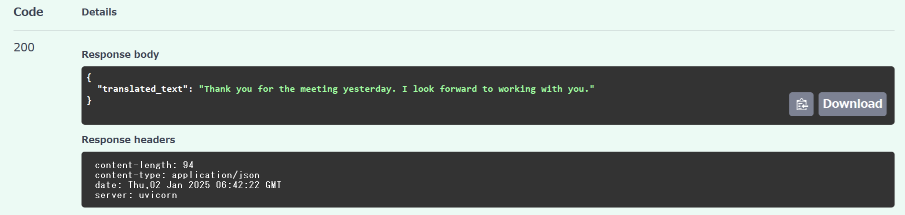

# Translation API

**A FastAPI-based translation service** powered by Google Cloud Translation API. This project demonstrates expertise in **API development**, **cloud integration**, and **backend engineering**—tailored for professional portfolios and global job applications.

---

## Overview

The **Translation API** enables seamless text translation with:
- **Language Detection**: Automatically identifies the source language.
- **Text Translation**: Converts text into the specified target language.
- **Error Handling**: Provides clear responses for invalid or unsupported requests.

This project showcases proficiency in:
- Developing RESTful APIs using FastAPI.
- Integrating Google Cloud services.
- Deploying high-performance applications.

---

## Project Structure

```
translation_app/
├── main.py                      # Main application file
├── auth.py                      # Authentication and JWT logic
├── models/                      # Pydantic models for API and user handling
│   ├── user_model.py            # User and UserInDB models
│   ├── token.py                 # Token models
│   ├── history_model.py         # Translation history model
├── routes/                      # Application routes
│   ├── translation.py           # Translation API logic
│   ├── user.py                  # User-related API routes
│   ├── history.py               # API route to clear translation history
├── services/                    # Application services and logic
│   ├── translate_service.py     # Google Translate integration
│   ├── history_service.py       # Logic for saving/retrieving history
├── utils/                       # Utility functions and helpers
│   ├── translate.py             # Google Translate integration
├── .env                         # Environment variables
├── .gitignore                   # Ignored files for Git
├── README.md                    # Project documentation
├── requirements.txt             # Dependencies
├── service-account-key.json     # GCP credentials file (ignored in Git)
└── request_translation.py       # Script for testing the API
```

---

## Features

- **Effortless Translation**: Supports multiple languages for accurate translation.
- **Source Language Detection**: No need to specify the input language—it’s auto-detected.
- **Developer-Friendly Interface**: Explore endpoints via Swagger UI.
- **Robust Error Management**: Ensures smooth operation with meaningful error messages.
- **JWT Authentication**: Secure access to endpoints with token-based authentication.
- **Clear Translation History**: Easily reset all saved translation data.


---

## Tech Stack

- **FastAPI**: A fast and modern Python web framework.
- **Google Cloud Translation API**: Industry-leading translation capabilities.
- **FastAPI-JWT-Auth**: Secure and flexible JWT authentication.
- **Python-dotenv**: Secure management of environment variables.
- **Uvicorn**: ASGI server for high-speed API hosting.


---

## API Endpoints

### Translate Text
- **URL**: `/translation/translate`
- **Method**: `POST`
- **Request Body**:
  ```json
  {
    "text": "Hello, world!",
    "target_language": "es"
  }
  ```
- **Response Example**:
  ```json
  {
    "translated_text": "¡Hola Mundo!",
    "source_language": "en"
  }
  ```

### Save Translation History
- **URL**: `/save-history/`
- **Method**: `POST`
- **Parameters**:
  - `source_text` (string, required): The original text before translation.
  - `translated_text` (string, required): The translated text.

- **Response Example**:
  ```json
  {
    "message": "History saved successfully"
  }
  ```

### Retrieve Translation History
- **Response Example**:
  ```json
  [
    {
      "source_text": "Hello, I hope this message finds you well. I am sharing the meeting materials.",
      "translated_text": "お世話になっております。会議の資料を共有いたします。",
      "timestamp": "2025-01-02T06:11:39.753698+00:00"
    },
    {
      "source_text": "Thank you for your email. I will get back to you shortly.",
      "translated_text": "Gracias por su correo electrónico. Me pondré en contacto con usted en breve.",
      "timestamp": "2025-01-02T06:12:12.456789+00:00"
    },
    {
      "source_text": "The museum is open from 10 AM to 6 PM. Tickets can be purchased online.",
      "translated_text": "Das Museum ist von 10 bis 18 Uhr geöffnet. Tickets können online gekauft werden.",
      "timestamp": "2025-01-02T06:15:45.123456+00:00"
    }
  ]
  ```

### Clear Translation History
- **URL**: `/history/clear-history`
- **Method**: `DELETET`
- **Description**: Deletes all saved translation history entries.
- **Response Example**:
  ```json
  {
    "message": "All translation history has been cleared."
  }
  ```

---

## Translation Examples with Screenshots

Here are some sample translations and their corresponding responses, including screenshots for clarity:

### Example 1: Translating from English to Norwegian

Request Body:
```json
{
  "text": "Thank you for your email. I will get back to you shortly.",
  "target_language": "no"
}
```
Response Body:
```json
{
  "translated_text": "Takk for e-posten din. Jeg vil kontakte deg snart."
}
```
Screenshot:


### Example 2: Translating from Japanese to French

Request Body:
```json
{
  "text": "このプロジェクトについてのご提案ありがとうございます。",
  "target_language": "fr"
}
```
Response Body:
```json
{
  "translated_text": "Merci pour votre proposition concernant ce projet."
}
```
Screenshot:


### Example 3: Translating from Danish to English

Request Body:
```json
{
  "text": "Tak for mødet i går. Jeg ser frem til at arbejde sammen med dig.",
  "target_language": "en"
}
```
Response Body:
```json
{
  "translated_text": "Thank you for the meeting yesterday. I look forward to working with you."
}
```
Screenshot:



### Example 4: Translating from German to English

Request Body:
```json
{
  "text": "Vielen Dank für Ihre Unterstützung bei diesem Projekt.",
  "target_language": "en"
}
```
Response Body:
```json
{
  "translated_text": "Thank you for your support in this project."
}
```
Screenshot:


## Setup Instructions

### 1. Clone the Repository
```bash
git clone https://github.com/yourusername/translation_app.git
cd translation_app
```

### 2. Install Dependencies
```bash
pip install -r requirements.txt
```
If JWT authentication is not already installed:
```bash
pip install fastapi-jwt-auth
```

### 3. Configure Google Cloud API
- Enable the **Google Cloud Translation API** in your GCP project.
- Create and download a **service account key** JSON file.
- Save the file in the project directory as `service-account-key.json`.

### 4. Run the Application
```bash
uvicorn main:app --reload
```

### 5. Explore the API
- Visit the **Swagger UI** at `http://127.0.0.1:8000/docs` for interactive testing.

---

## Future Improvements

This project is ready for real-world deployment and can be further enhanced:
- **Authentication**: Add user login and token-based security.
- **Docker Integration**: Simplify deployment and scaling.
- **Batch Processing**: Support translation of multiple texts in a single request.
- **Speech-to-Text Integration**: Extend functionality with audio processing.

---

## Why This Project?
- Built with a **clean and scalable architecture** to impress potential employers.
- Demonstrates **practical use of cloud services** and cutting-edge technology.
- Designed to highlight **core API development skills** required for modern backend engineering roles.

---

## Contact

For inquiries or collaboration opportunities, connect with me on [LinkedIn](https://www.linkedin.com/in/yuka-yamaguchi-214290342).

---

## License
MIT License
